# 【笔记】汇编语言

## 第1章 基础知识

### 1.1 机器语言

机器语言：机器指令的集合
机器指令：一台机器可以正确执行的命令
电子计算机的机器指令：一列二进制数字

CPU（Central Processing Unit，中央处理单元）：一种微处理器
每一种微处理器都有自己的机器指令集（机器语言）

### 1.2 汇编语言的产生

汇编语言的主体：汇编指令

编译器：将汇编指令转换为机器指令的翻译程序

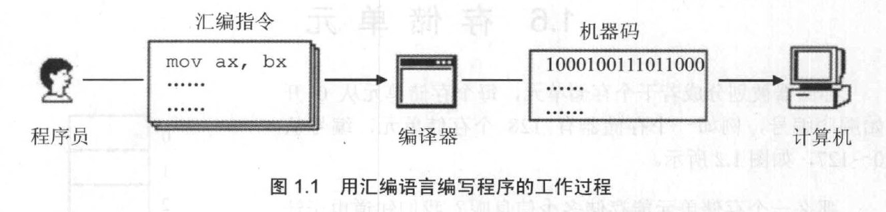

### 1.3 汇编语言的组成

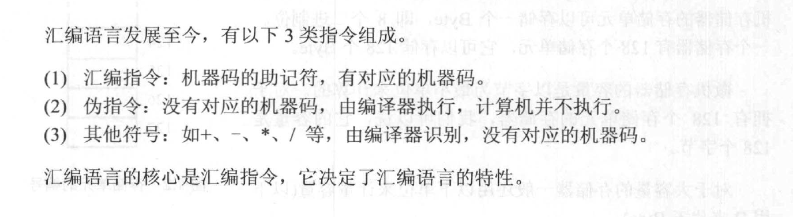

### 1.4 存储器

内存、磁盘

### 1.5 指令和数据

指令和数据：应用上的概念
	在内存或磁盘上，没有任何区别，都是二进制信息

### 1.6 存储单元

bit（比特）：一个二进制位，电子计算机的最小信息单位
Byte（字节）：8个bit

1KB = 1024B
1MB = 1024KB
1GB = 1024MB
1TB = 1024GB

### 1.7 CPU对存储器的读写

总线：
	地址总线
	控制总线
	数据总线

CPU要想进行数据的读写，必须和外部器件（芯片）进行下面3类信息的交互：
	地址信息：存储单元的地址
	控制信息：器件的选择、读或写的命令
	数据信息：读或写的数据

### 1.8 地址总线

地址线：N根
地址总线的宽度：N
CPU最多可以寻找的内存单元：2N个

### 1.9 数据总线

数据总线的宽度：决定了CPU和外界的数据传送速度

8088CPU的数据总线宽度：8
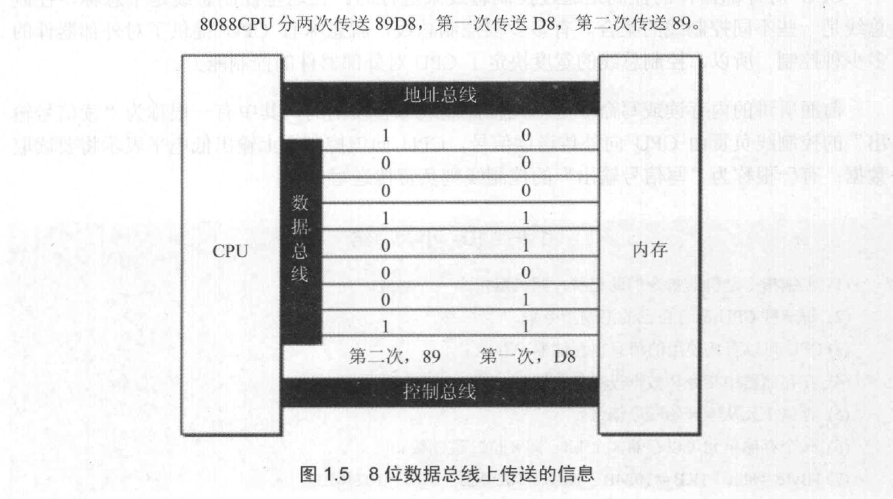

8086CPU的数据总线宽度：16
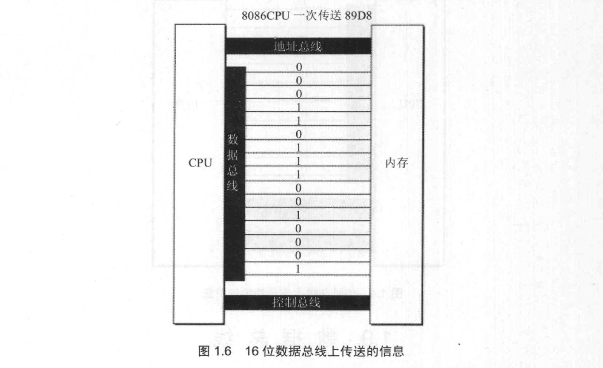

### 1.10 控制总线

控制总线的宽度：决定了CPU对外部器件的控制能力

### 1.1~1.10 小结

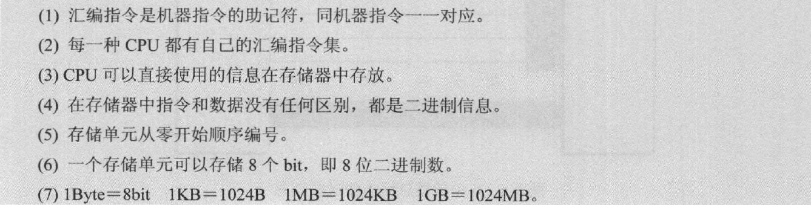
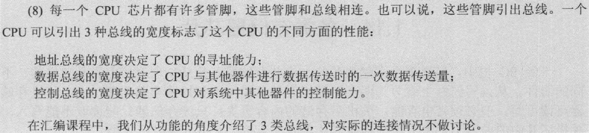

### 1.11 内存地址空间（概述）

地址总线宽度：10
可以寻址的内存单元：1024个
内存地址空间：1024个可寻到的内存单元

### 1.12 主板

主板上：核心器件、主要器件
	器件通过总线（地址总线、数据总线、控制总线）相连
	器件：CPU、存储器、外围芯片组、扩展插槽（插有RAM内存条、各类接口卡）

### 1.13 接口卡

CPU对外部设备都不能直接控制
直接控制这些设备进行工作的是插在扩展插槽上的接口卡
CPU可以直接控制接口卡实现对外设的间接控制
	CPU通过总线向接口卡发送命令，接口卡根据CPU的命令控制外设进行工作

### 1.14 各类存储器芯片

存储芯片：
	随机存储器（RAM）：可读可写，必须带电存储，关机后存储的内容丢失
	只读存储器（ROM）：只能读取不能写入，关机后其中的内容不丢失

存储器：

1. 随机存储器
   存放供CPU使用的绝大部分程序和数据
   主随机存储器：装在主板上的RAM、插在扩展插槽上的RAM
2. 装有BIOS的ROM
   BIOS（Basic Input/Output System，基本输入/输出系统）：主板、各类接口卡（如显卡、网卡）厂商提供的软件系统，进行最基本的输入输出
   主板上的ROM：存储主板的BIOS
   显卡上的ROM：存储显卡的BIOS
   网卡上的ROM：存储网卡的BIOS
3. 接口卡上的RAM
   对大批量输入、输出数据进行暂时存储
   典型：显存（显卡上的RAM）

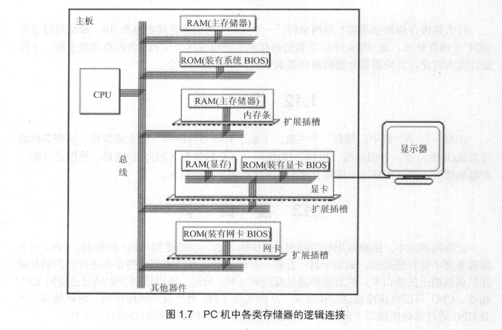

### 1.15 内存地址空间

逻辑存储器：由若干存储单元组成
内存地址空间：逻辑存储器

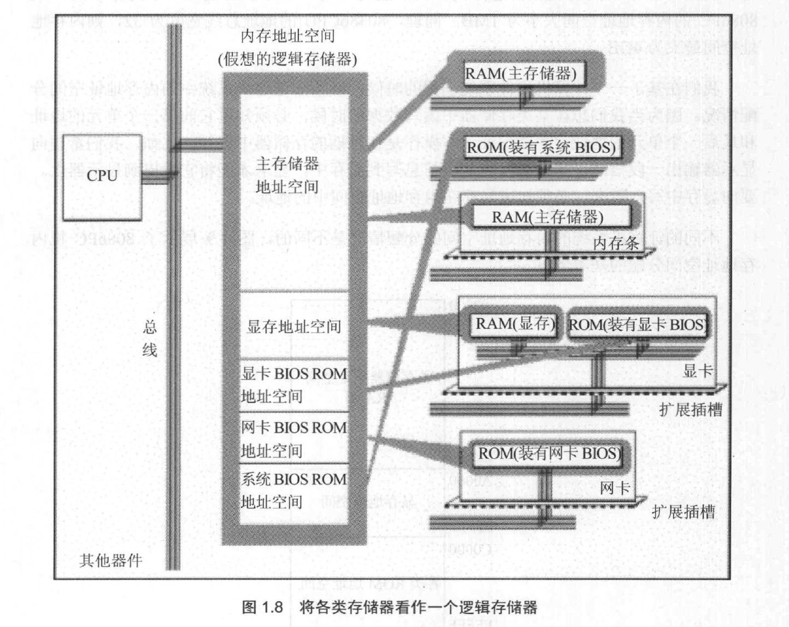

8086CPU：
	地址总线宽度：20
	传送地址信息：220个（0~220-1）
	定位内存单元：220个
	内存地址空间大小：1MB

80386CPU：
	地址总线宽度：32
	内存地址空间大侠：4GB

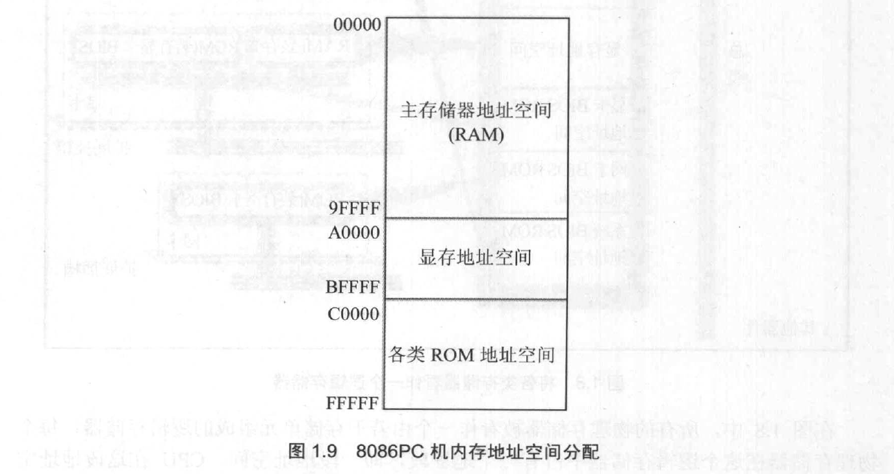

从地址0~9FFFF的内存单元中读取数据：读取主随机存储器中的数据
向地址A0000~BFFFF的内存单元中写入数据：向显存中写入数据，这些数据会被显示卡输出到显示器上
向地址C0000~FFFFF的内存单元中写入数据：无效，改写只读存储器中的内容

## 第2章 寄存器（CPU工作原理）

内部总线：实现CPU内部各个器件之间的联系
外部总线：实现CPU和主板上其他器件的联系

在CPU中：
	运算器：信息处理
	寄存器：信息存储
	控制器：控制各种器件进行工作
	内部总线：连接各种器件

8086CPU的14个寄存器：AX、BX、CX、DX、SI、DI、SP、BP、IP、CS、SS、DS、ES、PSW

### 2.1 通用寄存器

8086CPU的寄存器：16位（两个字节）
通用寄存器：AX、BX、CX、DX，存放一般性的数据

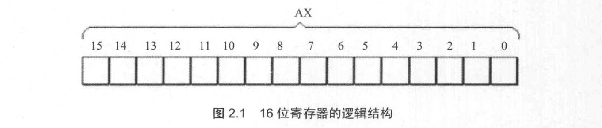

AX：AH、AL
BX：BH、BL
CX：CH、CL
DX：DH、DL

### 2.2 字在寄存器中的存储

8086CPU可以一次性处理两种尺寸的数据
	字节（byte）：由8个bit组成
	字（word）：由两个字节组成（高位字节+低位字节）

十进制：20000
十六进制：4E20H
二进制：0100111000100000B

### 2.3 几条汇编指令

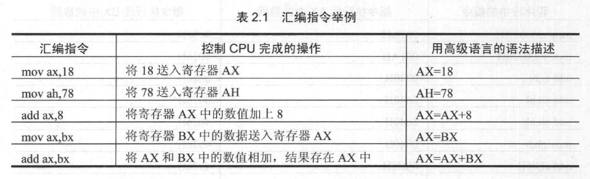

### 2.4 物理地址

物理地址：每一个内存单元在存储空间中的唯一地址

### 2.5 16位结构的CPU

16位结构 / 16位机 / 字长为16位：
	运算器一次最多可以处理16位的数据
	寄存器的最大宽度为16位
	寄存器和运算器之间的通路为16位

8086：16位结构的CPU
	一次性处理、传输、暂存的信息：16位（最大长度）
	一次性处理、传输、暂存的地址：16位

### 2.6 8086CPU给出物理地址的方法

8086CPU：
	地址总线：20位
	传送地址：20位
	寻址能力：1MB

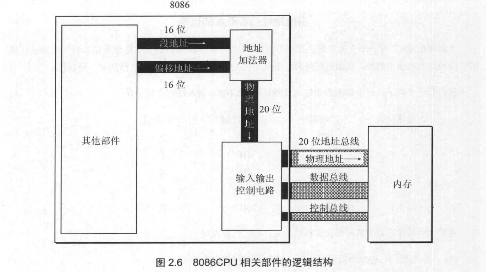

段地址：16位
偏移地址：16位
地址加法器：物理地址 = 段地址 × 16 + 偏移地址

### 2.7 “段地址 × 16 + 偏移地址 = 物理地址”的本质含义

物理地址 = 基础地址 + 偏移地址
基础地址 = 段地址 × 16

### 2.8 段的概念

段地址×16必然是16的倍数 → 一个段的起始地址一定是16的倍数
偏移地址为16位，16位地址的寻址能力为64KB → 一个段的长度最大为64KB

### 内存单元地址小结

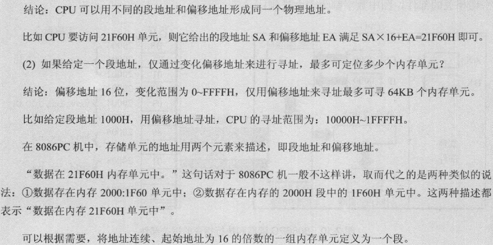

段地址SA
偏移地址EA

### 2.9 段寄存器

8086CPU的4个段寄存器：CS、DS、SS、ES

### 2.10 CS和IP

CS和IP：指示了CPU当前要读取指令的地址
CS：代码段寄存器
IP：指令指针寄存器

CS的内容：M
IP的内存：N
→ 8086CPU从内存M×16+N单元开始，读取一条指令并执行

8086机中，任意时刻，CPU将CS:IP指向的内容当作指令执行

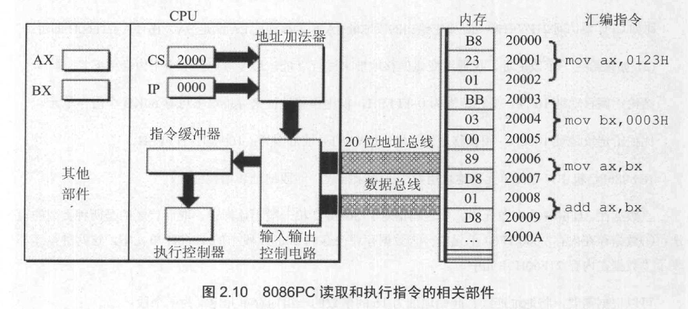

8086CPU的工作过程：
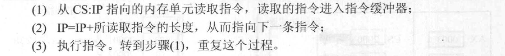

在8086CPU加电启动或复位后（CPU刚开始工作时）：CS=FFFFH、IP=0000H
	从内存FFFF0H单元中读取指令执行
	FFFF0H单元中的指令是8086PC机开机后执行的第一条指令

CPU根据什么将内存中的信息看作指令？
	CPU将CS:IP指向的内存单元中的内容看作指令

### 2.11 修改CS、IP的指令

转移指令：能够改变CS、IP的内容的指令

jmp指令

jmp 段地址:偏移地址
	用指令中给出的段地址修改CS，偏移地址修改IP
	jmp 2AE3:3 → CS=2AE3H、IP=0003H，CPU将从2AE33H处读取指令
	jmp 3:0B16 → CS=0003H、IP=0B16H，CPU将从00B46H处读取指令

jmp 某一合法寄存器
	用寄存器中的值修改IP
	jmp ax
		指令执行前：ax=1000H、CS=2000H、IP=0003H
		指令执行后：ax=1000H、CS=2000H、IP=1000H
	相当于：mov IP, ax

### 2.12 代码段

代码段：将长度为N（N ≤ 64KB）的一组代码，存在一组地址连续、起始地址为16的倍数的内存单元中

### 2.9~2.12 小结

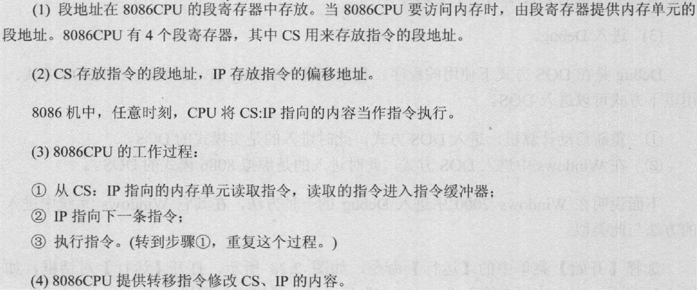

### 实验1 查看CPU和内存，用机器指令和汇编指令编程

（1）什么是Debug？

Debug程序：DOS、Windows都提供的实模式（8086方式）程序的调试工具

（2）用到的Debug功能

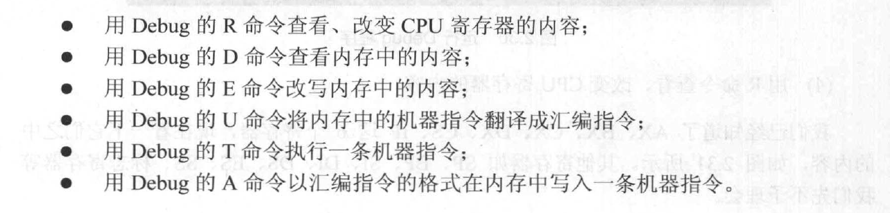

（3）进入Debug

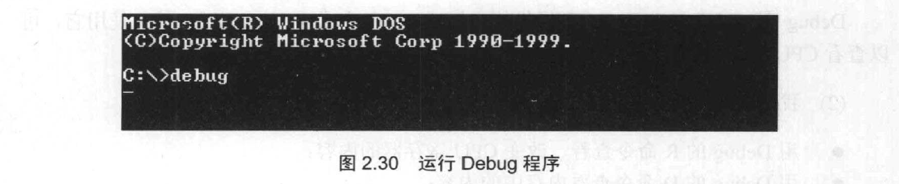

（4）R命令：查看、改变CPU寄存器的内容

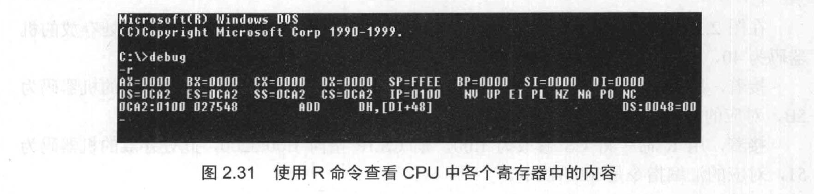

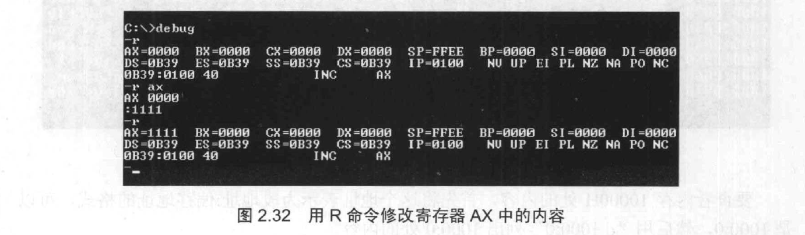

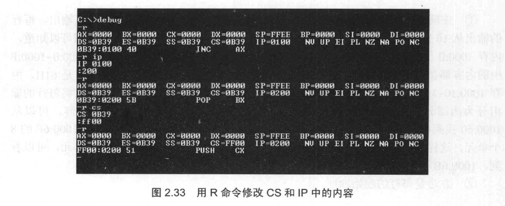

（5）D命令：查看内存中的内容

d 段地址:偏移地址
	列出从指定内存单元开始的128个内存单元的内容
	d 1000:0 → 列出了1000:0~1000:7F中的内容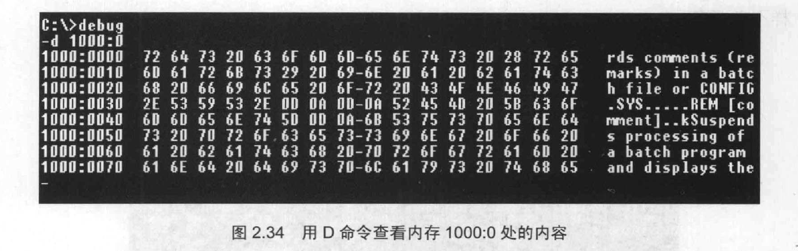

在一进入Debug后，用D命令直接查看：列出Debug预设的地址处的内容
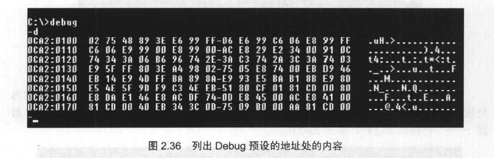

在使用“d 段地址:偏移地址”之后，接着使用D命令：列出后续的内容
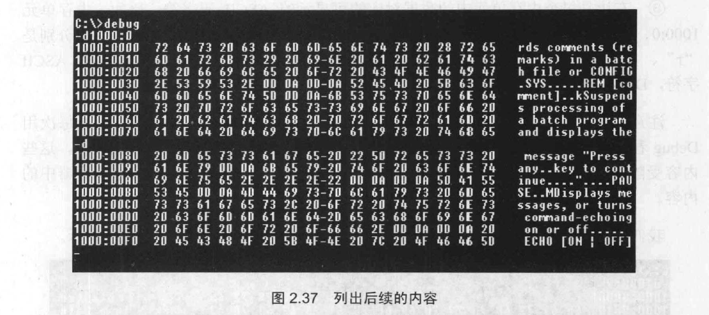

指定D命令的查看范围：d 段地址:起始偏移地址 结尾偏移地址
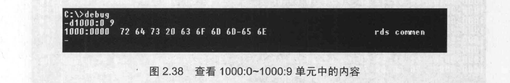

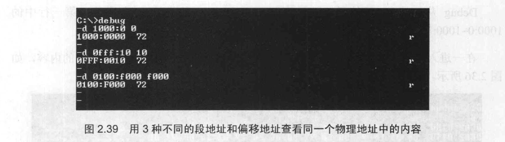

（6）E命令：改写内存中的内容

e 起始地址 数据 数据 数据 ······
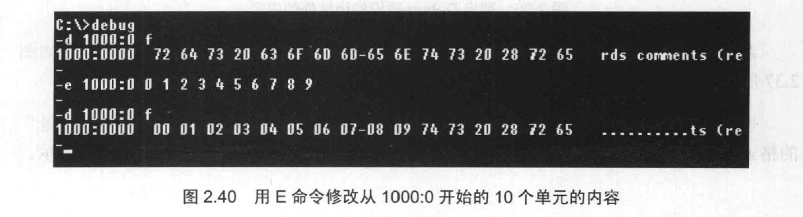

从内存1000:0开始写入：数值1、字符“a”、数值2、字符“b”、数值3、字符“c”：
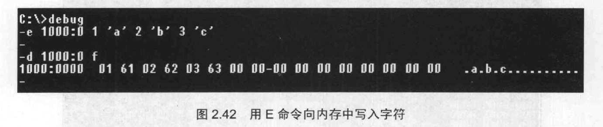

从内存1000:0开始写入：数值1、字符串“a+b”、数值2、字符串“c++”、数值3、字符串“IBM”：
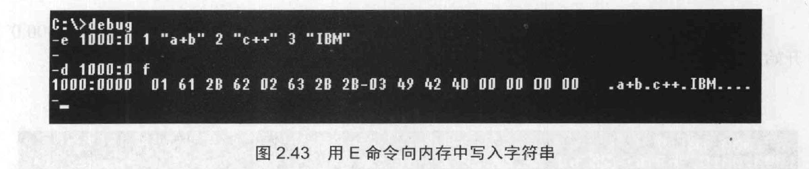

（7）E命令：向内存中写入机器码
		U命令：查看内存中机器码的含义
		T命令：执行内存中的机器码

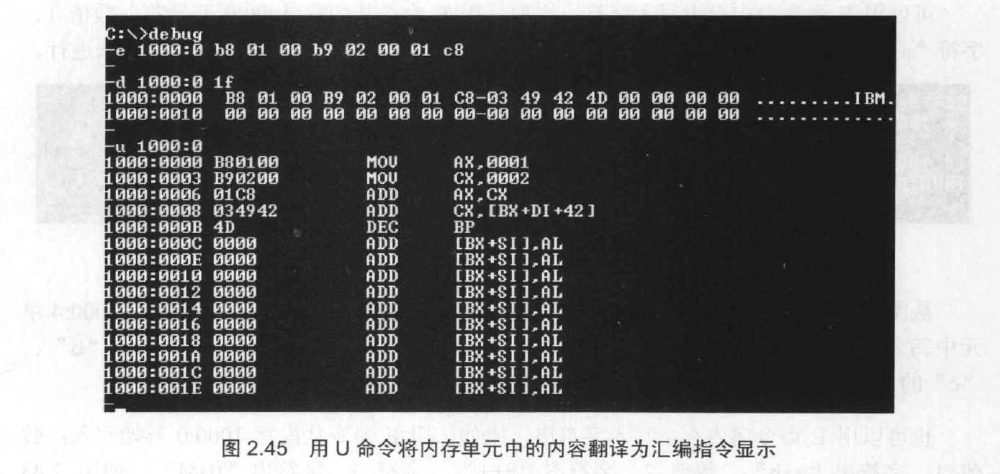

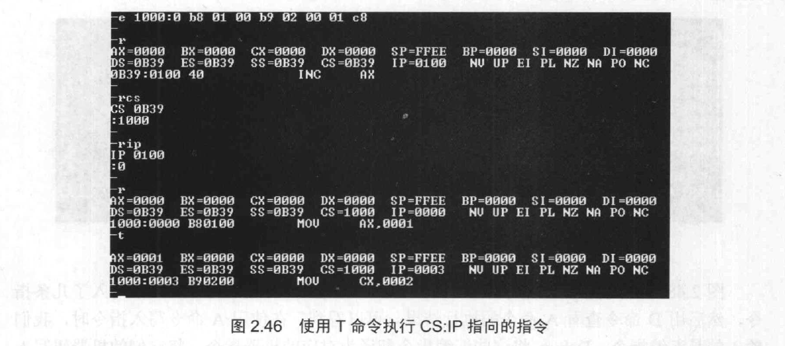

（8）A命令：以汇编指令的形式在内存中写入机器指令

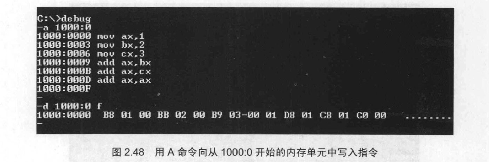

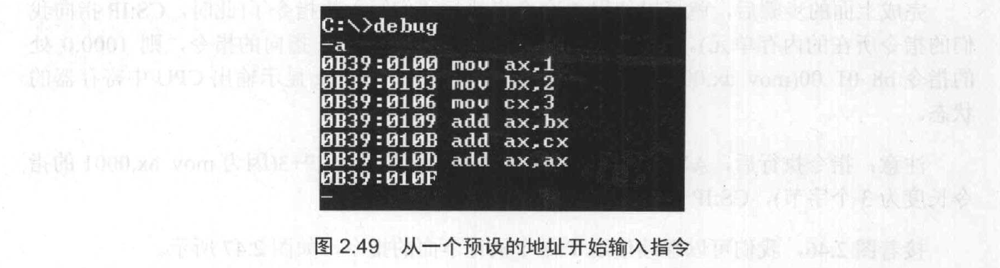

### 本次实验中需要用到的命令

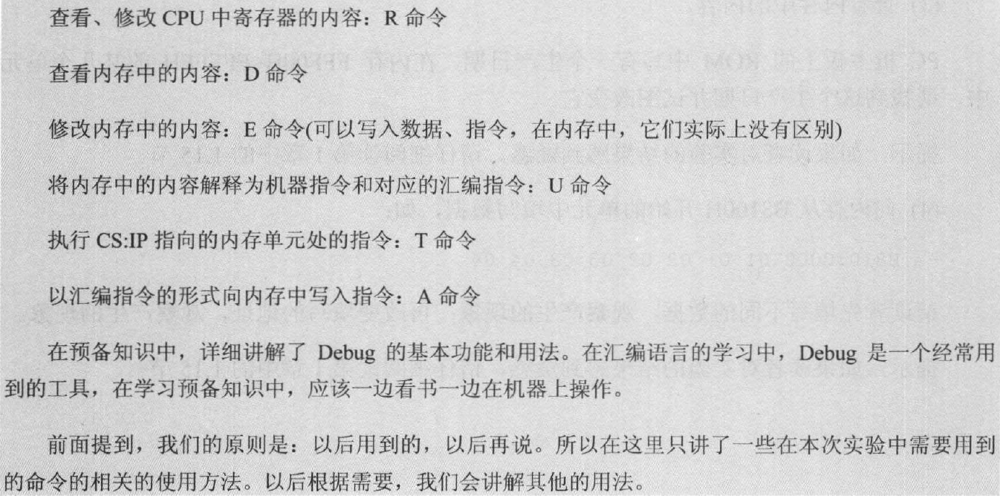

## 第3章 寄存器（内存访问）

### 3.1 内存中字的存储

16位寄存器：
	高8位：高位字节
	低8位：低位字节

内存中存储：
	低地址单元：低位字节
	高地址单元：高位字节

用0、1号内存单元存放数据20000（4E20H）
用2、3号内存单元存放数据18（0012H）
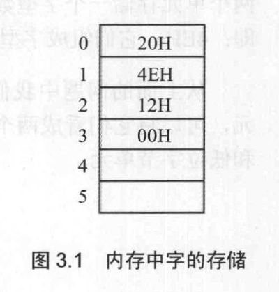

字单元：存放一个字型数据（16位）的内存单元
	由两个地址连续的内存单元组成
	高地址内存单元：存放字型数据的高位字节
	低地址内存单元：存放字型数据的低位字节

N地址字单元：起始地址为N的字单元
	N号单元：低位字节单元
	N+1号单元：高位字节单元

### 3.2 DS和[address]

DS寄存器：存放要访问数据的段地址

读取10000H单元的内容：

8086CPU不支持将数据直接送入段寄存器的操作
	mov ds, 1000H → 指令非法

将al中的数据送入内存单元10000H中：

### 3.3 字的传送

传送16位数据：在mov指令中给出16位的寄存器：
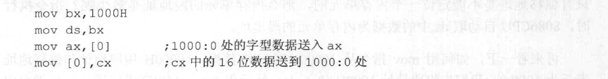

### 3.4 mov、add、sub指令

mov指令的几种形式：

mov 寄存器, 段寄存器
mov 内存单元, 段寄存器
mov 段寄存器, 内存单元

add、sub指令：
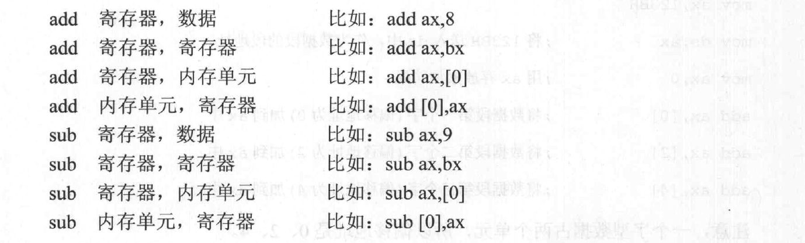

### 3.5 数据段

数据段：将一组长度为N（N ≤ 64KB）、地址连续、起始地址为16的倍数的内存单元当作专门存储数据的内存空间

### 3.1~3.5 小结

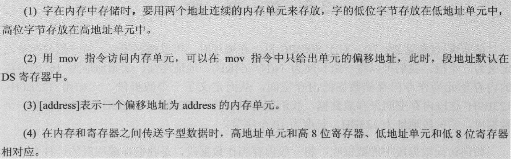
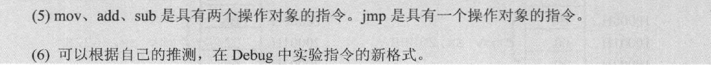

### 3.6 栈

入栈：将一个新的元素放到栈顶
出栈：从栈顶取出一个元素

栈顶的元素：最后入栈，需要出栈时，又最先被从栈中取出（LIFO，Last In First Out，后进先出）

### 3.7 CPU提供的栈机制

入栈：PUSH
	push ax：将寄存器ax中的数据送入栈中

出栈：POP
	pop ax：从栈顶取出数据送入ax

8086CPU的入栈和出栈操作：都是以字为单位进行的

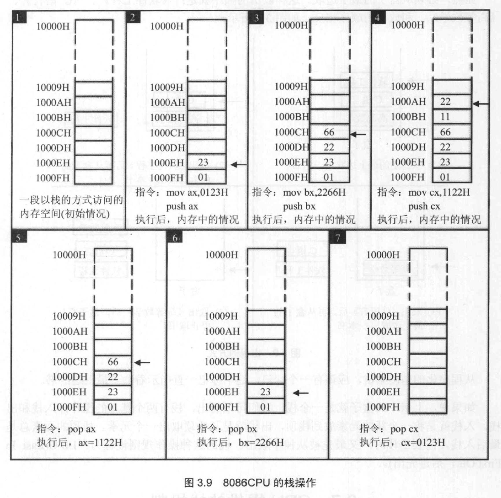

8086CPU：
	段寄存器SS：栈顶的段地址
	寄存器SP：栈的偏移地址

任意时刻，SS:SP指向栈顶元素

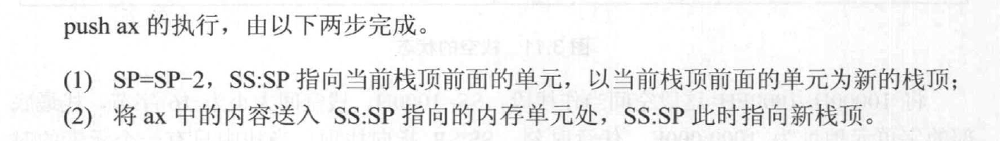

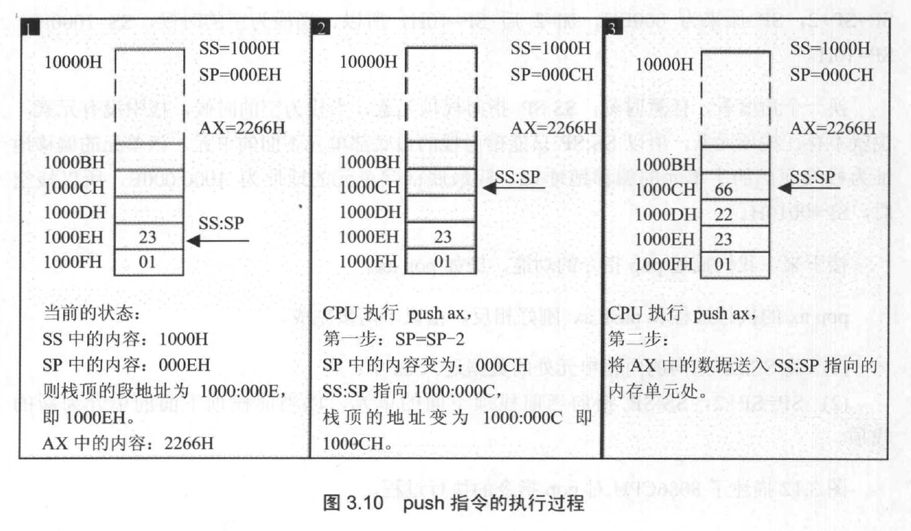

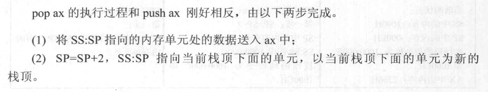

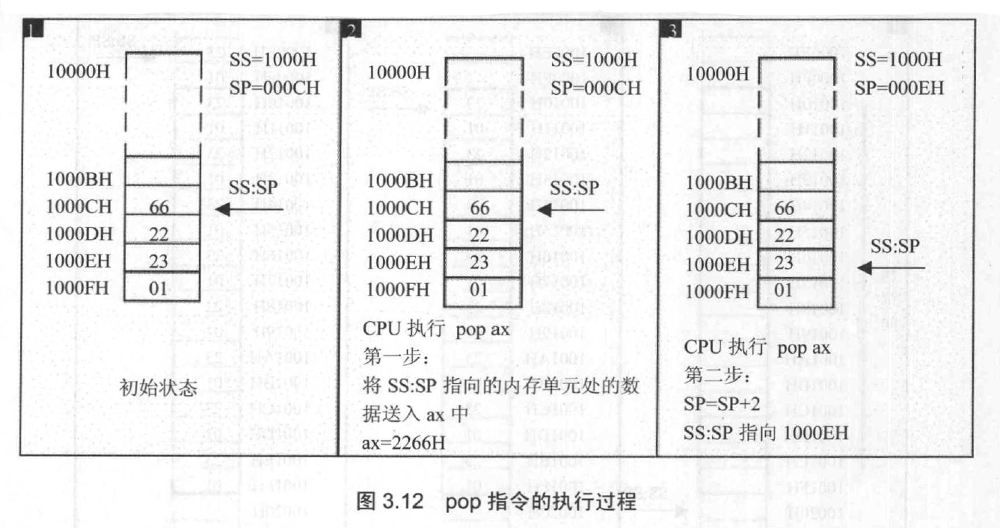

### 3.8 栈顶超界的问题

